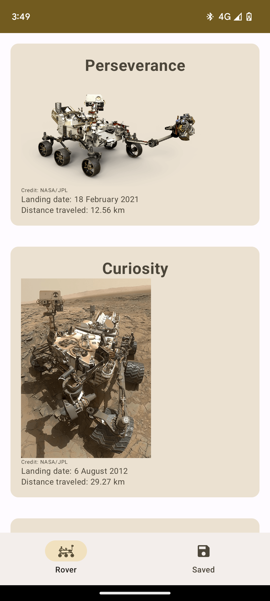
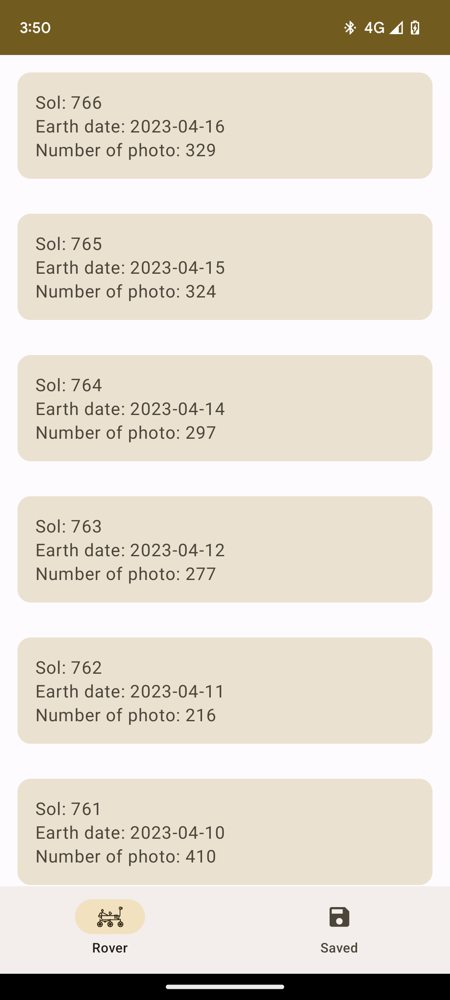
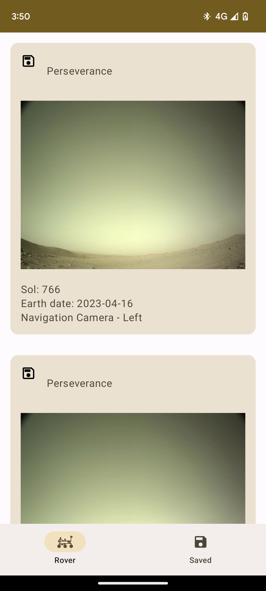
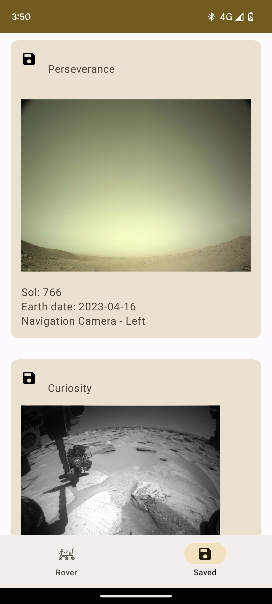
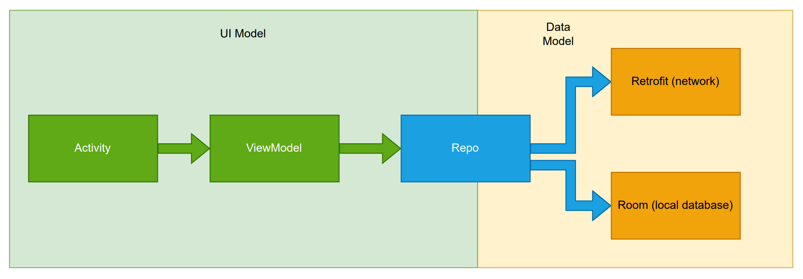

# mars-photo-exporer
This Android application shows photo taken by the Mars rovers send by NASA.

This app is example for this [Android Jetpack Compose Udemy course](https://www.udemy.com/course/android-jetpack-compose-retrofit-room-hilt/?referralCode=E687F9D8E0057A0DF4B2)

### Features

The first screen display a list of rovers hard coded in the app.

The second display list of sol (day on Mars) for the rover. For each item in the list the corresponding earth date and the number of photos are displayed.

The thrid screen display a list of photo for the previously chosen rover and sol.

The fourth screen display the list of saved photo for all rovers. It is avialable by the bottom nav.

### Code architecture

The code is divided in four layers.

The Android UI component are represented in green. The Activity is an Android Activity. The ViewModel is from the Android Jetpack library.

The repository is represented in blue. It will transform and mix data from the data layer.

The data layer in orange are Room and Retrofit interfaces.

An article that describe this [architecture with Hilt, Retrofit, Room with Jetpack Compose is avialable on Medium](https://medium.com/@alexandre.genet7/android-viewmodel-repository-room-and-retrofit-with-jetpack-compose-2b652d8ff3b9).

